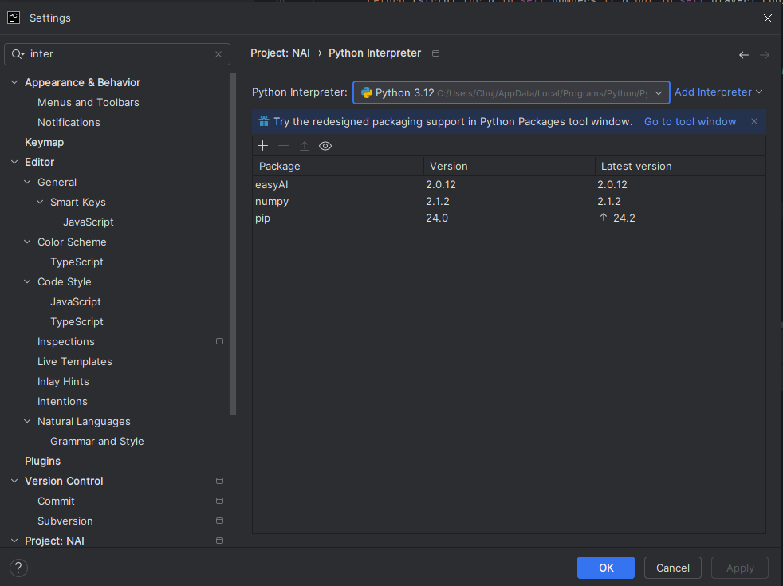

# Odd or Even Game

## Gameplay Rules
- The game starts with a list of numbers from 1 to 10.
- Players take turns selecting a number that has not been chosen yet.
- After both players have made their selections in a round, the sum of the chosen numbers is calculated:
- If the sum is odd, Player 1 (Odd) scores a point.
- If the sum is even, Player 2 (Even) scores a point.
- The game continues until all numbers from the list have been chosen.
- The player with the most points at the end of the game wins.

## Players
- Player 1 (Human): The human player inputs their choice from the available numbers.
- Player 2 (AI): The AI player chooses its move based on a strategy to maximize its chances of winning.

## How to Play
- Clone the repository and install the required dependencies (EasyAI library).
- Run the game script.
- Follow the prompts to select numbers as Player 1.
- Watch the AI make its moves.

## Screenshot from game

## Installation
Make sure you have Python installed, and install the EasyAI library.

## Authors
- Arkadiusz Kluczek
- Damian Ligęza