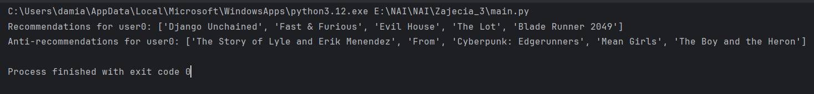
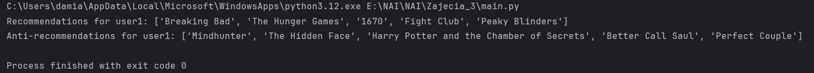
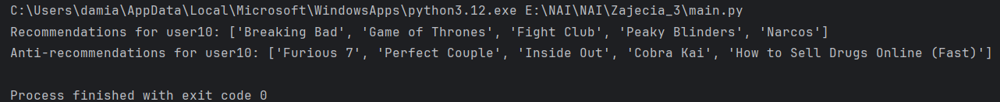

# Movie Recommendation and Anti-Recommendation System

## Problem Description

This project implements a movie recommendation and anti-recommendation system based on collaborative filtering using KMeans clustering. The system uses user ratings of movies to group users with similar preferences and recommends movies that are highly rated by users in the same cluster, but not yet seen by the target user. Similarly, the system also generates anti-recommendations for movies that users in the same cluster tend to dislike.

## Authors

- **Arkadiusz Kluczek**
- **Damian Ligęza**

## Installation

1. Install required dependencies:
`pip install -r requirements.txt`

## Usage

The system works with a JSON file containing user ratings of movies and TV shows. Each user has a dictionary of ratings for various movies. The recommendation function `recommend_and_anti_recommend` accepts the following parameters:

- `data`: A dictionary containing user ratings for various movies.
- `target_user_id`: The ID of the user for whom recommendations and anti-recommendations are generated.
- `n_clusters` (optional): The number of clusters to form. Default is 3.
- `n_recommend` (optional): The number of recommended movies to return. Default is 5.
- `n_anti` (optional): The number of anti-recommended movies to return. Default is 5.

The function returns two lists:
- A list of recommended movies.
- A list of anti-recommended movies.

## Example Scenarios
### Scenario 1

### Scenario 2

### Scenario 3
