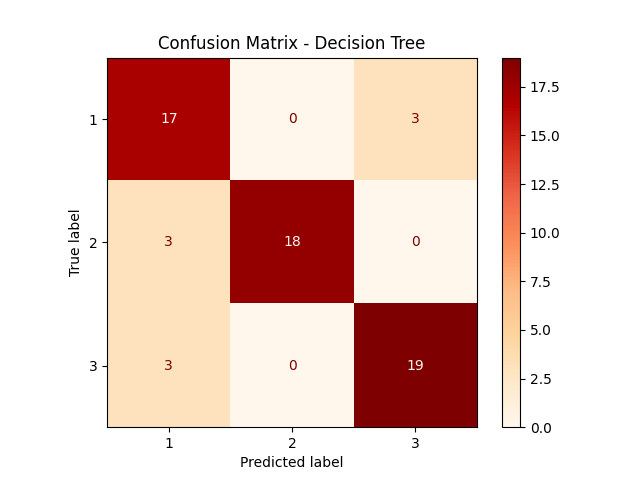
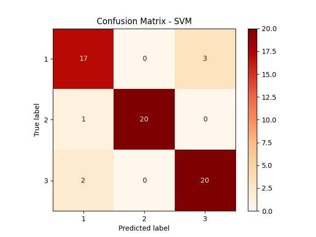
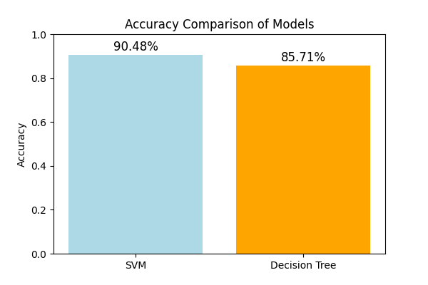
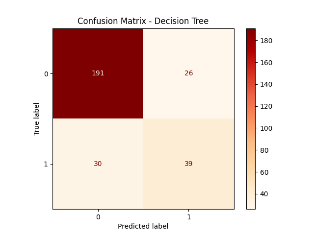
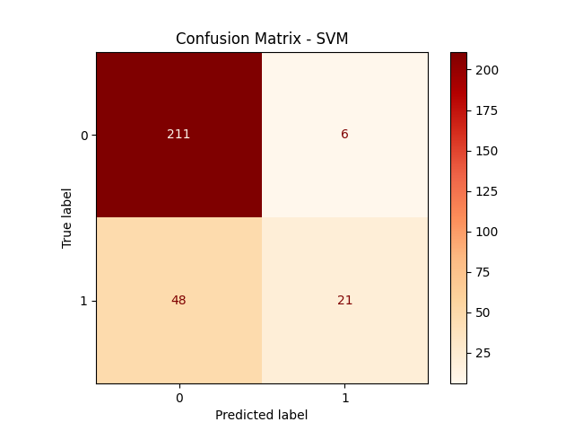
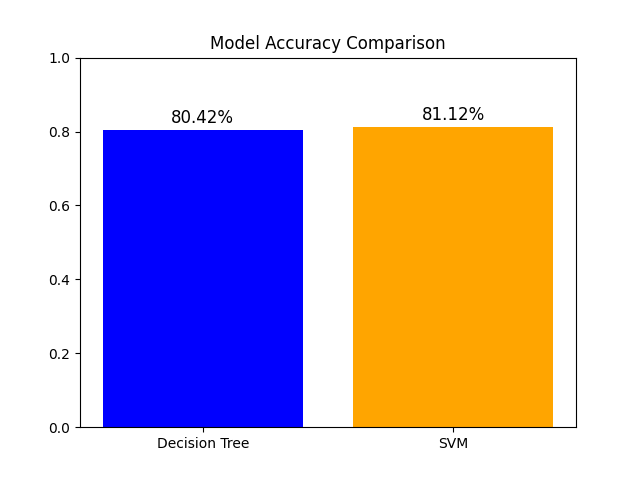

## Authors
- Arkadiusz Kluczek
- Damian Ligęza

## Datasets
https://archive.ics.uci.edu/dataset/2/adult
http://archive.ics.uci.edu/ml/machine-learning-databases/00236/seeds_dataset.txt

## Wheat Seed
Decision tree

SVM

Comparison

## Adult
Decision tree

SVM

Comparison

## Installation
Make sure you have Python installed, and install these libraries:
- pandas
- numpy
- sklearn
- matplotlib
