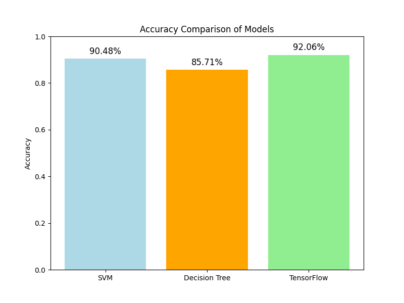
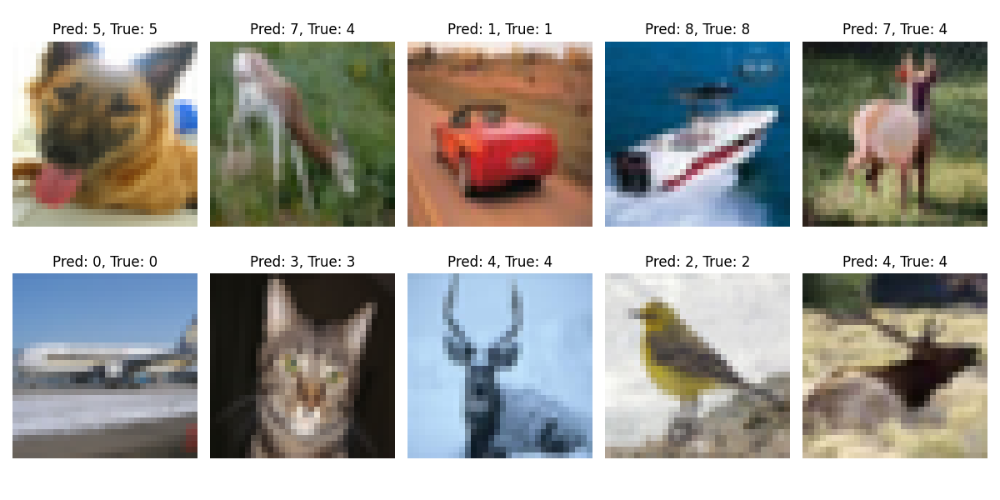
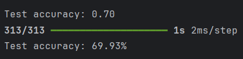
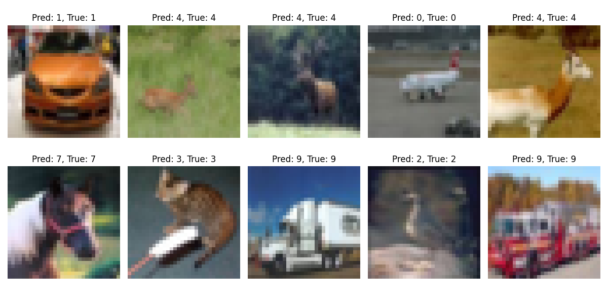
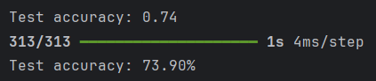
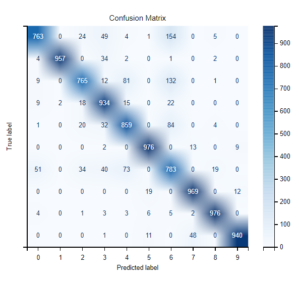

## Authors
- Arkadiusz Kluczek
- Damian Ligęza

## Datasets
http://archive.ics.uci.edu/ml/machine-learning-databases/00236/seeds_dataset.txt

## Wheat Seed
Comparison

## CIFAR-10
### First size

### Second size

## fashion-mnist
Confusion Matrix

## Installation
Make sure you have Python installed, and install these libraries:
- pandas
- numpy
- sklearn
- matplotlib
- tensorflow